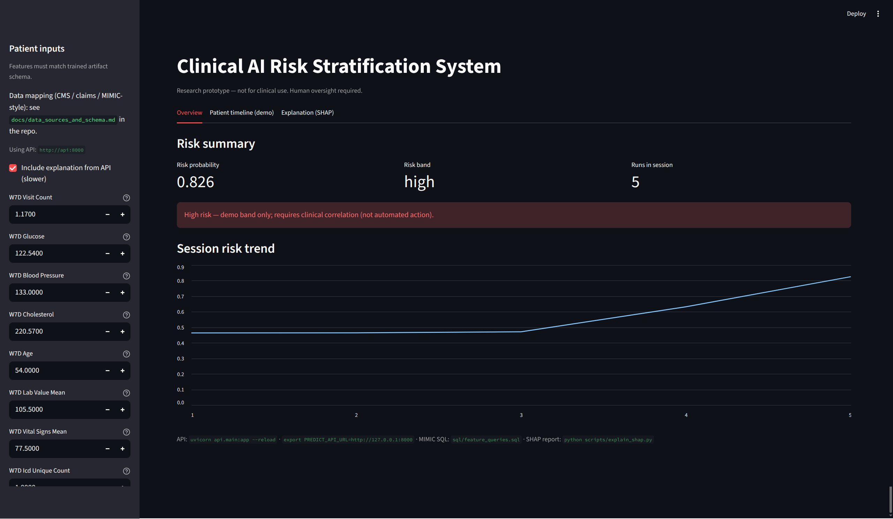
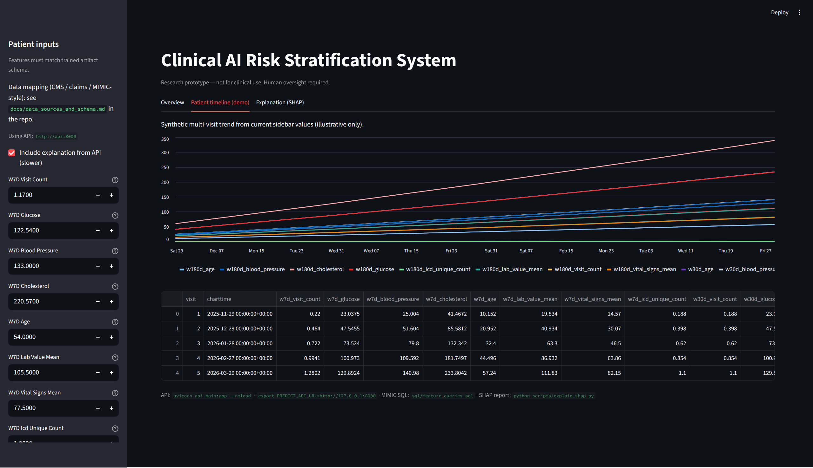
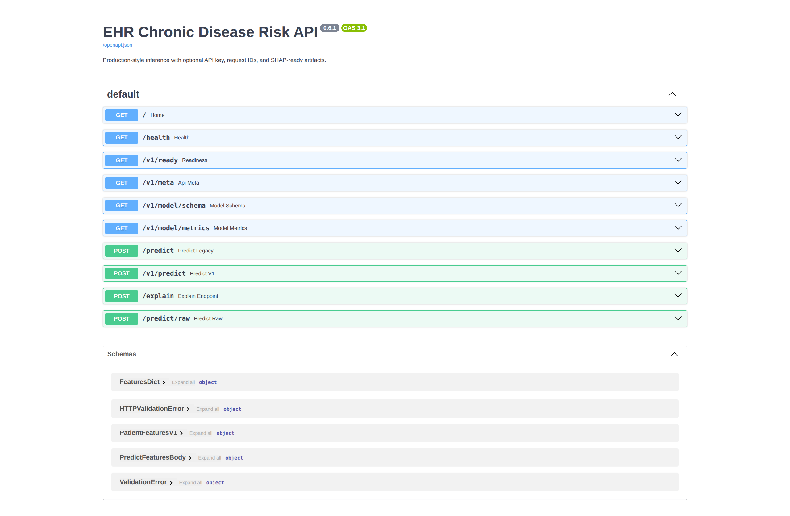

# EHR-Based Chronic Disease Risk Prediction System

Research-oriented code for **chronic disease risk** from EHR-style tabular and longitudinal data: time-window features, training and evaluation (including patient-level and temporal splits), SHAP explanations, a **FastAPI** inference service, a **Streamlit** dashboard, and **Docker** compose for local runs.

**License:** [MIT](LICENSE). Dependencies in `requirements.txt` are under their own licenses. **Maintainer and attribution:** [`AUTHORS.md`](AUTHORS.md).

---

## System scope by engineering area

The codebase is grouped by the usual engineering boundaries (data, ML, API, UI, ops).

| Area | What it covers | Primary paths |
|------|----------------|---------------|
| **Data / ETL** | MIMIC-style SQL + temporal ETL, leakage-aware windows | `sql/mimic_queries.sql`, `preprocessing/feature_engineering.py`, `preprocessing/mimic_pipeline.py`, `feature_engineering/multi_window.py` |
| **ML** | Baselines + XGBoost (+ optional LightGBM), calibration, metrics JSON | `training/train.py`, `models/train.py`, `models/calibration.py`, `reports/evaluation_report.json`, `reports/feature_importance.json` |
| **Explainability** | SHAP + JSON for API | `explainability/shap_explainer.py`, `explainability/explanation.py` |
| **API** | `/health`, `/v1/ready`, `/v1/predict`, `/v1/model/metrics`, `POST /explain` | `api/main.py` |
| **UI** | Streamlit dashboard | `dashboard/app.py` |
| **MLOps** | Docker + CI | `deployment/Dockerfile`, `Dockerfile`, `docker-compose.yml`, `.github/workflows/ci.yml` |
| **Research draft** | IEEE-style manuscript (Markdown) | `research_paper/paper.md`, `docs/ieee_paper_draft.md` |

**Engineering rules baked in:** temporal windows anchored at last event (demo) or cohort index time (production); multi-scale **7d / 30d / 180d** longitudinal features; **isotonic calibration** optional; **explanations default-on** for `/v1/predict` and `/predict/raw`; reproducible JSON reports.

---

## Roadmap

### What this repository already includes

| Phase | Focus | Primary artifacts |
|-------|--------|-------------------|
| **Weeks 1–2** | Cohort extract patterns, patient splits, leakage checks | [`docs/mimic_week1_2_runbook.md`](docs/mimic_week1_2_runbook.md), [`sql/feature_queries.sql`](sql/feature_queries.sql), `training/reproduce_split.py`, [`scripts/leakage_audit.py`](scripts/leakage_audit.py), `training.train` with `--split-by-patient` or `--temporal-split`, [`docs/external_validation.md`](docs/external_validation.md) |
| **Week 3** | XGBoost / baselines, `--calibrate`, SHAP, fairness scripts | `training/train.py`, [`scripts/explain_shap.py`](scripts/explain_shap.py), [`scripts/fairness_report.py`](scripts/fairness_report.py) |
| **Week 4** | API, Streamlit, Docker, CI | [`api/main.py`](api/main.py), [`dashboard/app.py`](dashboard/app.py), [`docker-compose.yml`](docker-compose.yml), [`scripts/docker_smoke.sh`](scripts/docker_smoke.sh), [`.github/workflows/ci.yml`](.github/workflows/ci.yml) |
| **Weeks 5–6** | Paper drafts | [`research_paper/paper.md`](research_paper/paper.md), [`docs/ieee_paper_draft.md`](docs/ieee_paper_draft.md) |

*Running SQL on live **MIMIC-IV**, IRB-approved cohorts, and journal submission require your own credentials and processes.*

### Suggested next steps (outside this repo)

| Phase | Focus |
|--------|--------|
| Weeks 1–2 | Credentialed **MIMIC-IV** extract with `sql/feature_queries.sql`; confirm patient-level splits and leakage audits on your cohort |
| Week 3 | Lock **XGBoost** + calibration; SHAP and fairness on held-out data |
| Week 4 | Harden Streamlit + FastAPI for your environment; repeat **Docker** smoke tests |
| Weeks 5–6 | Revise manuscript; public release checklist (license, data statement, model cards) |

---

## Overview

Use cases:

- Early detection of chronic conditions (e.g., diabetes, CVD) in a **research / prototype** setting — not a regulated medical device
- **MIMIC-style** SQL templates (`sql/feature_queries.sql`) and timeline helpers (`preprocessing/mimic_pipeline.py`)
- **Longitudinal demo** (`data/raw/ehr_data.csv`, `feature_engineering/time_window_features.py`)
- **SHAP** (`explainability/shap_explainer.py`, `scripts/explain_shap.py`)
- Subgroup metrics stubs (`fairness/`) when sensitive attributes exist

---

## Problem statement

Chronic diseases drive a large share of U.S. mortality, morbidity, and cost. Earlier risk identification from routinely collected EHR data can support preventive care and resource targeting—when models are validated, calibrated, and deployed under appropriate governance.

---

## Key features

- **Tabular** demo (`data/raw/sample_ehr.csv`) and **longitudinal** EHR-style demo (`data/raw/ehr_data.csv`)
- Time-window aggregation (default **180 days**) anchored at each patient’s last timestamp
- Machine learning: **XGBoost (default)**, logistic regression, Random Forest (`--model`)
- Hold-out metrics: ROC-AUC, PR-AUC, Brier score, precision/recall/F1 (`training/evaluate.py`)
- **Isotonic calibration** via `CalibratedClassifierCV` (`models/calibration.py`, train with `--calibrate`)
- **Calibration curve** PNG on each train (`training/eval_plots.py` → `reports/calibration_holdout.png`)
- **Lead-time** utilities (`models/calibration.py::compute_lead_time_days`, `training/evaluate.py::print_lead_time_summary`)
- **SHAP** global summary plots (TreeExplainer / LinearExplainer; unwraps calibrated tree base estimators)
- Fairness roadmap: subgroup metrics (`fairness/bias_metrics.py`)
- **Streamlit** dashboard (schema-driven inputs; optional FastAPI)
- **FastAPI** production-style API: `/`, `/health`, **`/v1/meta`** (governance JSON), `/v1/model/schema`, **`/v1/model/metrics`** (hold-out JSON + SHA alignment vs artifact), `/v1/predict`, `/predict` (legacy body); optional **`API_KEY`** + `X-API-Key`; response header **`X-Clinical-Disclaimer`**
- **Real-world data alignment:** column aliasing for CMS/claims-style exports → [`docs/data_sources_and_schema.md`](docs/data_sources_and_schema.md); CLI [`scripts/normalize_longitudinal_csv.py`](scripts/normalize_longitudinal_csv.py)
- **Class imbalance:** XGBoost `scale_pos_weight` from training labels (including **calibrated** training path)
- **IEEE-style draft:** [`docs/ieee_paper_draft.md`](docs/ieee_paper_draft.md)
- **Docker:** [`Dockerfile`](Dockerfile), [`docker-compose.yml`](docker-compose.yml) (API + Streamlit)

---

## Real-world and government-style data

Public U.S. sources (DE-SynPUF, HCUP, credentialed MIMIC-IV) are usually **joined** into tables with patient id + event time + diagnosis/labs. This repo expects that **shape**; see **[`docs/data_sources_and_schema.md`](docs/data_sources_and_schema.md)** for mapping notes and governance. Demo CSVs under `data/raw/` are synthetic teaching data only.

---

## Production and testing

- **Env:** copy [`.env.example`](.env.example) — `API_KEY`, `CORS_ORIGINS`, `MODEL_PATH`, optional **`PREDICT_API_KEY`** for Streamlit → API
- **Health:** `GET /health` (model file on disk, fast); **`GET /v1/ready`** (artifact loads — use for load balancers)
- **Schema:** `GET /v1/model/schema` may include **`input_stats`** (median / p05 / p95 from training) for building forms
- **Validation:** finite numeric features only (NaN/Inf → HTTP 400); pre-train CSV checks: `python scripts/validate_training_data.py --format longitudinal data/raw/ehr_data.csv`
- **Splits:** `python -m training.train --split-by-patient` (patient-level holdout) or `--temporal-split` (longitudinal: latest patients in test); **group CV:** `make cv-report` or `scripts/group_cv_report.py` → `reports/cv_group_metrics.json`
- **Tests:** `PYTHONPATH=. pytest tests/ -q`
- **CI:** [`.github/workflows/ci.yml`](.github/workflows/ci.yml) runs train + leakage audit + pytest + **temporal train / temporal leakage audit** + **group CV script** + Docker smoke (**`/v1/model/metrics`** when `reports/evaluation_report.json` is present in the build context)
- **Payload / abuse:** `MAX_BODY_BYTES` (default 256 KiB), `RATE_LIMIT_PER_MINUTE` (0 = off), `AUDIT_LOG_JSONL` (append-only JSON lines for POST predict/explain — **no feature values**)
- **Reproducibility:** `reports/training_manifest.json` (data SHA-256, git revision, split); `evaluation_report.json` includes **ECE** and optional **bootstrap ROC-AUC CI** (`--bootstrap-samples N`)
- **Pre-spec:** copy [`docs/study_protocol.md`](docs/study_protocol.md) before real cohort work
- **Makefile:** `make test`, `make train-patient`, `make train-temporal`, `make cv-report`, `make leak-audit`, `make docker-smoke`

### Benchmark table (fill after each locked cohort)

| Cohort | N patients | Split | ROC-AUC | PR-AUC | Brier | ECE | Notes |
|--------|------------|-------|---------|--------|-------|-----|--------|
| Demo `ehr_data.csv` | 10 | patient | see `reports/evaluation_report.json` | | | | Teaching only |

---

## System architecture

```text
EHR / MIMIC extracts → SQL + timeline merge → Time-window features → ML (+ optional calibration) → Risk score → SHAP → FastAPI / Streamlit
```

---

## Models

| Model | Role |
|--------|------|
| Logistic Regression | Strong linear baseline (`models/baseline_logreg.py`) |
| Random Forest | Nonlinear ensemble baseline (`models/random_forest_model.py`) |
| **XGBoost** | **Default trainer** (`models/xgboost_model.py`) |
| LSTM (optional) | Temporal modeling placeholder (`models/lstm_model.py`) |

Train with:

```bash
python -m training.train                  # default: XGBoost
python -m training.train --model logreg
python -m training.train --model random_forest
python -m training.train --format longitudinal --data data/raw/ehr_data.csv
python -m training.train --format longitudinal --model logreg --calibrate
python -m training.train --format longitudinal --data data/raw/ehr_data.csv --split-by-patient --bootstrap-samples 500 --ece-bins 10
```

---

## Evaluation metrics

Reported on the hold-out split (see `training/evaluate.py`):

- **AUC-ROC**
- **PR-AUC** (average precision)
- **Brier score** (probability sharpness / calibration-related)
- **Precision, recall, F1** at threshold 0.5
- **Accuracy** (reported for completeness; not primary for imbalanced outcomes)
- **Reliability / calibration curve** (saved under `reports/` by default)
- **Lead-time gain** (when aligned `lead_days` and labels are supplied — see `print_lead_time_summary`)

---

## Explainability

- `explainability/shap_explainer.py`: `explain_model(...)`, `explain_single_patient(...)` (tree models + LR pipeline)
- After training: `python scripts/explain_shap.py` → `reports/shap_summary.png` (gitignored)

---

## Fairness

Evaluate model behavior across subgroups when sensitive attributes are available (age bands, sex/gender, etc.). Stubs live under `fairness/`; production use requires cohort design and governance.

---

## Demo UI

**Streamlit** (`dashboard/app.py`):

- Sidebar inputs driven by `feature_columns` in `model.pkl`
- Overview tab: metrics, session **risk trend**
- Timeline tab: **synthetic multi-visit** series (illustrative from current inputs)
- SHAP tab: local **bar chart** of |SHAP| (when `shap` is installed)
- Optional FastAPI via `PREDICT_API_URL` (`POST /v1/predict`)

### Screenshots

**Streamlit — Overview** (risk summary and session trend)



**Streamlit — Patient timeline** (illustrative multi-visit series from sidebar inputs)



**FastAPI — OpenAPI docs** (`/docs` when the API is running)



---

## Quick start

**Ubuntu / Debian — `ensurepip` failed or `externally-managed-environment`:** your `venv` likely has **no `pip`**, so the shell used **system** `pip` (blocked by PEP 668). Fix one of these ways:

```bash
# A) Install venv + ensurepip support, then recreate .venv (replace 3.13 with: python3 --version)
sudo apt update
sudo apt install -y python3-venv python3-full python3-pip
cd /path/to/ehr-chronic-disease-risk-prediction
rm -rf .venv
python3 -m venv .venv
source .venv/bin/activate
python -m pip install -U pip setuptools wheel
pip install -r requirements.txt
pip install -e .
```

```bash
# B) Use uv (works even when distro venv is broken): https://docs.astral.sh/uv/
curl -LsSf https://astral.sh/uv/install.sh | sh   # or: sudo apt install uv / pipx install uv
cd /path/to/ehr-chronic-disease-risk-prediction
rm -rf .venv
uv venv .venv
source .venv/bin/activate
uv pip install -r requirements.txt
uv pip install -e .
```

---

```bash
git clone <your-repository-url>
cd ehr-chronic-disease-risk-prediction   # or your clone directory name

python3 -m venv .venv
source .venv/bin/activate   # Windows: .venv\Scripts\activate

python -m pip install -U pip   # prefer this over bare `pip` to hit the venv’s pip
pip install -r requirements.txt
pip install -e .

# Tabular demo (default)
python -m training.train

# Longitudinal MIMIC-style demo
python -m training.train --format longitudinal --data data/raw/ehr_data.csv --window-days 180

# With isotonic calibration (refits base estimator inside CV folds)
python -m training.train --format longitudinal --data data/raw/ehr_data.csv --model logreg --calibrate

# SHAP summary figure (requires artifact trained with current code so `data_path` is stored)
python scripts/explain_shap.py

# Docker — see **Run entirely in Docker** below (no host venv required)

uvicorn api.main:app --reload
# other terminal:
streamlit run dashboard/app.py
```

To point the dashboard at the API:

```bash
export PREDICT_API_URL=http://127.0.0.1:8000
streamlit run dashboard/app.py
```

**API notes:** `GET /v1/model/schema` returns the exact `feature_columns` for the trained artifact. Longitudinal models require **`POST /v1/predict`** with `{"features": {...}}` or **`POST /predict/raw`** with a flat JSON object. `POST /predict` (Pydantic body) matches the **tabular** demo (age, glucose, blood_pressure, cholesterol) only.

---

## Run entirely in Docker (no local `venv`)

Use this when **`python3 -m venv` / `ensurepip` fails** or you do not want a host Python install. Images use **`python:3.11-slim`** with **`pip`** inside the container only.

### One command (prepare → API → Streamlit)

**`prepare`** runs first: it trains **only if** `model.pkl` is missing or empty (or you set **`FORCE_TRAIN=1`**). Then **api** and **dashboard** start.

```bash
cd /path/to/ehr-chronic-disease-risk-prediction
docker compose up --build
```

Equivalent:

```bash
bash scripts/docker_all.sh              # foreground
bash scripts/docker_all.sh -d            # detached background
```

- API: [http://127.0.0.1:8000](http://127.0.0.1:8000) (`/health`, `/docs`, `/v1/model/metrics`)
- Dashboard: [http://127.0.0.1:8501](http://127.0.0.1:8501)

Requires **Docker Compose v2.20+** (for `depends_on: condition: service_completed_successfully`).

### Run pieces separately

| Goal | Command |
|------|--------|
| **Train only** (always run training, ignore existing `model.pkl`) | `docker compose --profile train run --rm train` |
| **Prepare only** (same logic as full stack: skip if `model.pkl` exists) | `docker compose run --rm prepare` |
| **Force retrain** on next full `up` | `rm -f model.pkl` or `FORCE_TRAIN=1 docker compose up --build` |
| **API + dashboard only** (skip `prepare`; you must already have `model.pkl`) | `docker compose up --no-deps api dashboard` |
| **API only** | `docker compose up --no-deps api` |

**Custom train** (profile `train`; replaces the default command for that run):

```bash
docker compose --profile train run --rm train python -m training.train --format longitudinal --data data/raw/ehr_data.csv --model xgboost --split-by-patient
```

**Mounts:** `prepare` / **`train`** use the repo mounted at **`/workspace`** so training reads your host **`data/raw/`**. **api** and **dashboard** mount **`model.pkl`** and **`reports/`** from the host.

**If `model.pkl` is wrong:** delete it or use **`FORCE_TRAIN=1`** so **`prepare`** runs training again. Avoid an **empty file** at `model.pkl` on the host (Docker can create a directory by mistake if the path is wrong); the **`prepare`** step normally creates a real file first.

---

## Project structure

```text
ehr-chronic-disease-risk-prediction/
├── README.md
├── LICENSE
├── AUTHORS.md
├── requirements.txt
├── setup.py
├── .gitignore
├── .env.example
├── data/
│   ├── raw/                 # e.g. sample_ehr.csv
│   └── processed/
├── notebooks/
│   ├── 01_eda.ipynb
│   └── 02_feature_engineering.ipynb
├── screenshots/             # UI + API images (see Demo UI → Screenshots)
├── docs/
│   ├── data_sources_and_schema.md
│   ├── external_validation.md
│   ├── ieee_paper_draft.md
│   ├── mimic_week1_2_runbook.md
│   └── study_protocol.md
├── research_paper/
│   └── paper.md
├── sql/
│   ├── feature_queries.sql
│   └── mimic_queries.sql
├── Dockerfile
├── docker-compose.yml
├── deployment/
│   └── Dockerfile
├── .github/workflows/
│   └── ci.yml
├── preprocessing/
│   ├── feature_engineering.py
│   ├── mimic_pipeline.py
│   ├── ehr_loader.py
│   ├── cleaning.py
│   └── time_windowing.py
├── feature_engineering/
│   ├── patient_features.py
│   ├── time_window_features.py
│   └── aggregation.py
├── scripts/
│   ├── explain_shap.py
│   ├── leakage_audit.py
│   ├── docker_all.sh
│   ├── docker_prepare.sh
│   ├── docker_smoke.sh
│   ├── group_cv_report.py
│   └── …
├── reports/
├── models/
│   ├── train.py
│   ├── baseline_logreg.py
│   ├── calibration.py
│   ├── lightgbm_model.py
│   ├── random_forest_model.py
│   ├── xgboost_model.py
│   └── lstm_model.py
├── training/
│   ├── train.py
│   ├── evaluate.py
│   ├── eval_plots.py
│   └── reporting.py
├── explainability/
│   └── shap_explainer.py
├── fairness/
│   └── bias_metrics.py
├── inference/
│   └── predict.py
├── api/
│   └── main.py
├── dashboard/
│   └── app.py
└── utils/
    ├── config.py
    └── logger.py
```

---

## Disclaimer

This software is for **research and educational decision-support prototyping only**. It is **not** a medical device and does **not** provide diagnosis or treatment advice. Clinical or production use requires appropriate validation, regulatory compliance, and institutional oversight.

Contact and affiliation: **[AUTHORS.md](AUTHORS.md)**.

---

## License

Distributed under the [MIT License](LICENSE). You may use, modify, and distribute the project subject to the license terms. **Demo data** in `data/raw/` is synthetic for teaching; **MIMIC-IV** and other restricted datasets are not redistributed and must be obtained under their respective terms (e.g., PhysioNet).
