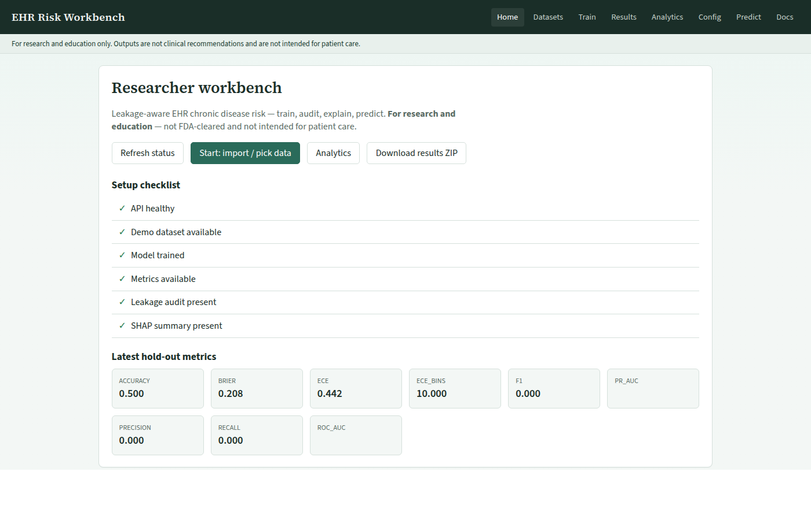
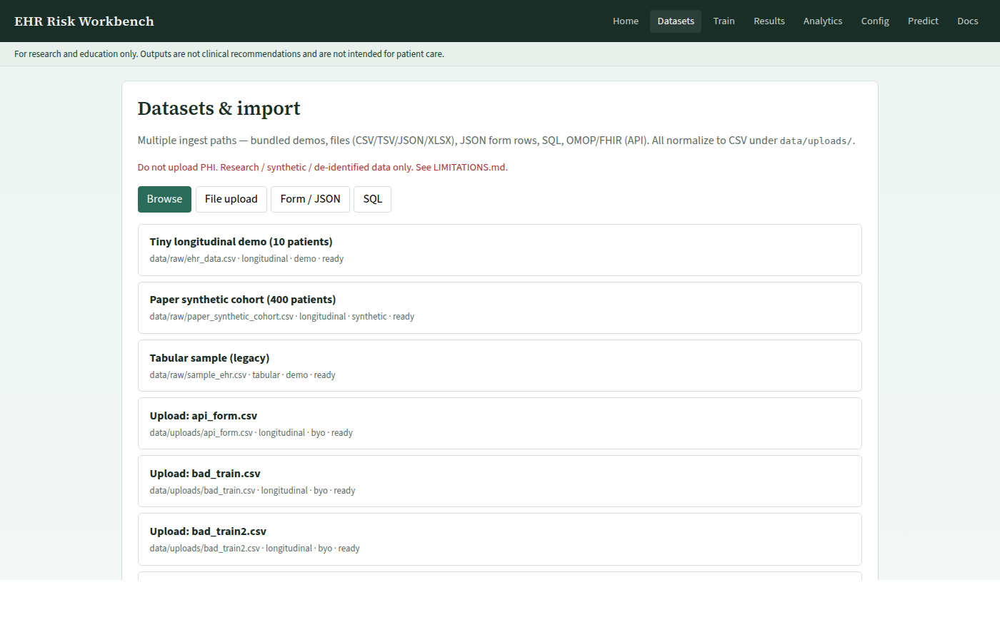
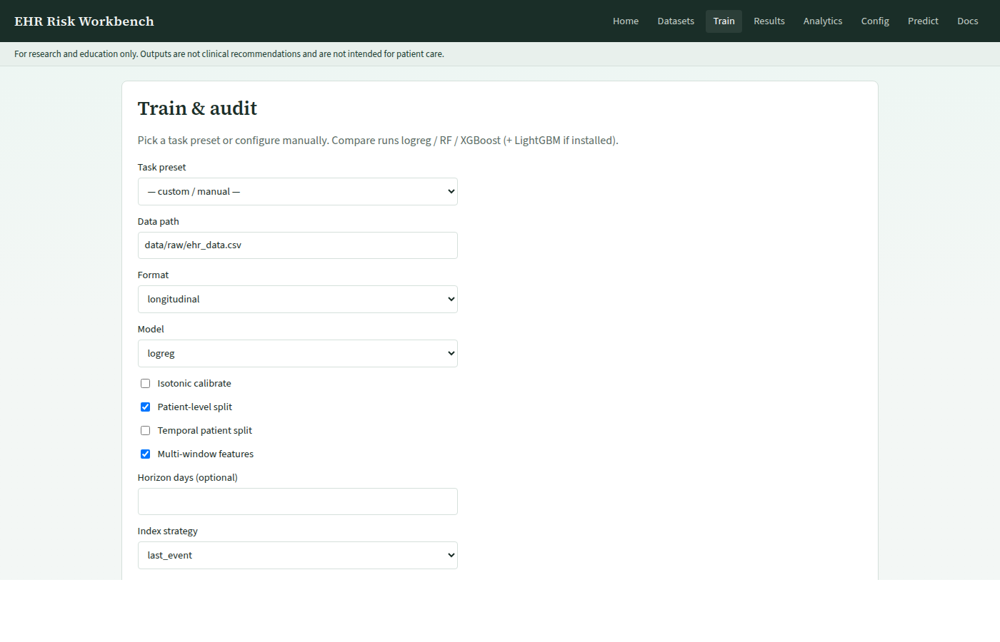
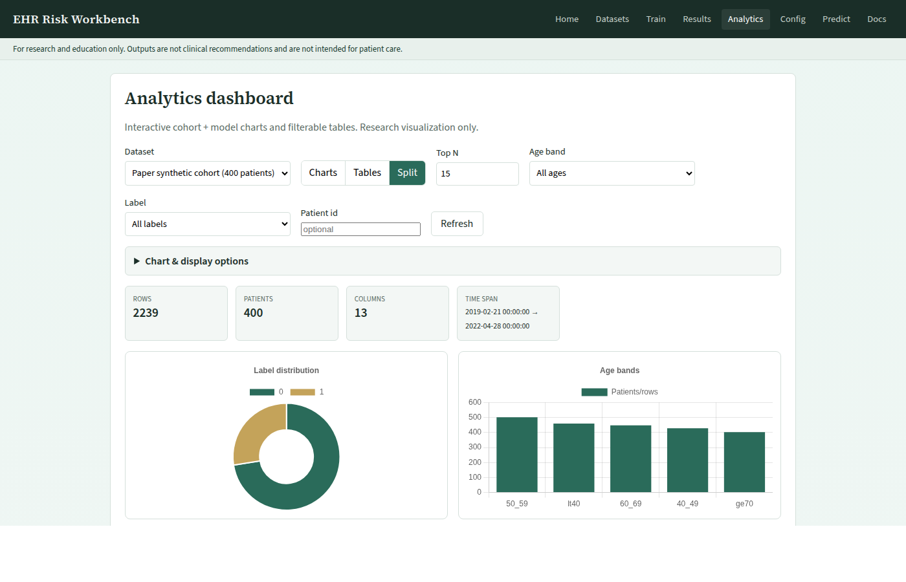
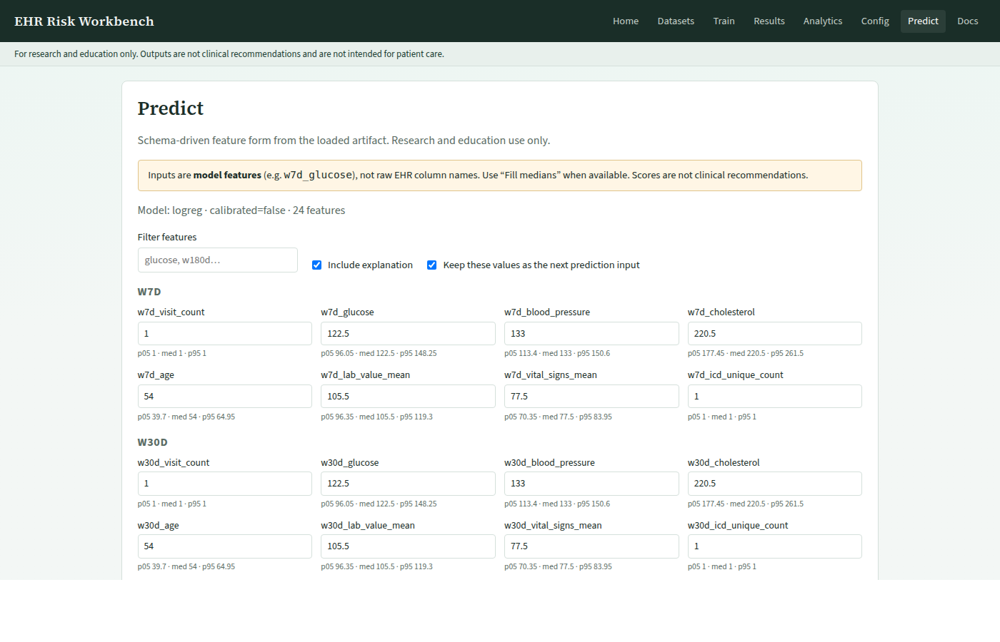
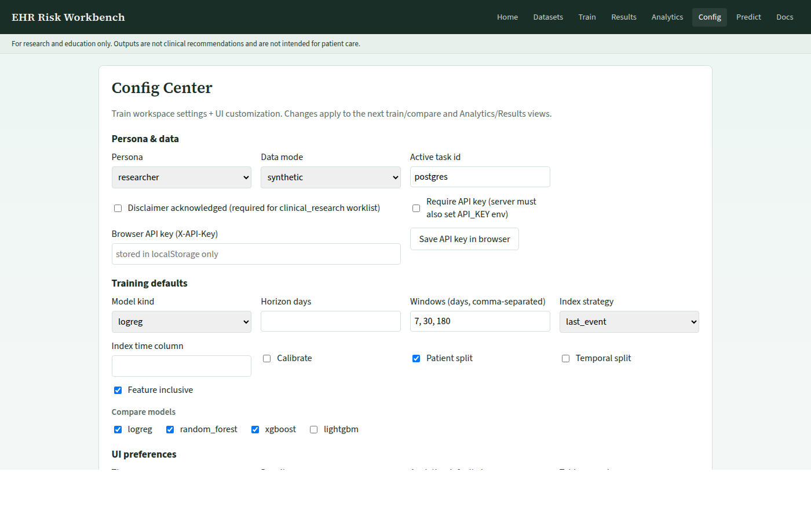
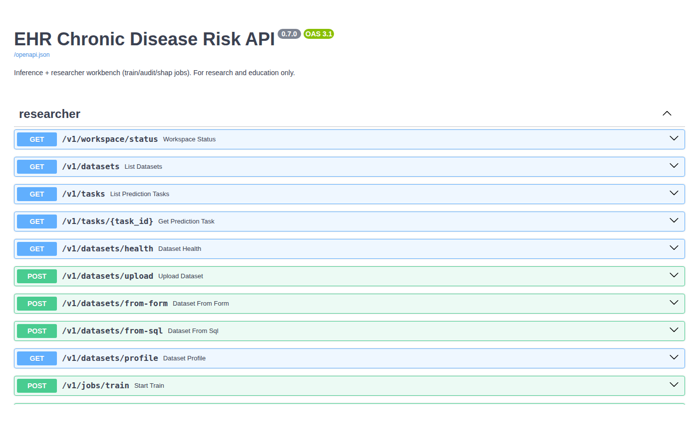

# EHR Risk Framework

[](https://github.com/ranasl62/ehr-chronic-disease-risk-prediction/actions/workflows/ci.yml)
[](LICENSE)
[](CHANGELOG.md)

**Leakage-aware, calibrated, explainable** EHR risk modeling for research and education.  
Default demos cover chronic-disease-style horizons; any binary outcome with an index time and horizon can use the same pipeline (see `tasks/`).  
Package `openhealth` · CLI `ehr-ai` · Angular workbench · FastAPI.

> **For research and education only.** Outputs are not clinical recommendations and are not intended for patient care.

**Maintainer:** Md Rana Hossain  
**Contact:** [support@larucare.com](mailto:support@larucare.com) · [LinkedIn](https://www.linkedin.com/in/mdranahossain/)  
**Feedback & how it helps:** [`docs/HOW_IT_HELPS.md`](docs/HOW_IT_HELPS.md)

| Doc | Link |
|-----|------|
| **Documentation website** | [`docs/website/`](docs/website/) → [GitHub Pages](https://ranasl62.github.io/ehr-chronic-disease-risk-prediction/) (enable Actions source in Settings → Pages) |
| Architecture | [`ARCHITECTURE.md`](ARCHITECTURE.md) |
| Install | [`INSTALLATION.md`](INSTALLATION.md) |
| Data | [`DATA_GUIDE.md`](DATA_GUIDE.md) |
| Why / limits | [`WHY_THIS_FRAMEWORK.md`](WHY_THIS_FRAMEWORK.md) · [`LIMITATIONS.md`](LIMITATIONS.md) |
| Quickstart | [`docs/researcher_quickstart.md`](docs/researcher_quickstart.md) |
| Model card | [`docs/model_card.md`](docs/model_card.md) |
| Cite | [`CITATION.cff`](CITATION.cff) |

---

## 5-minute start — Docker (recommended)

### Build from source

```bash
git clone https://github.com/ranasl62/ehr-chronic-disease-risk-prediction.git
cd ehr-chronic-disease-risk-prediction
docker compose up --build
# detached: make researcher-up-d
# stop:     docker compose down   # or: make researcher-down
```

### Pull published images (no local build)

When images are published to Docker Hub (public repos, or after `docker login`):

```bash
git clone https://github.com/ranasl62/ehr-chronic-disease-risk-prediction.git
cd ehr-chronic-disease-risk-prediction
docker compose -f docker-compose.yml -f docker-compose.publish.yml pull
docker compose -f docker-compose.yml -f docker-compose.publish.yml up
# or: make researcher-up-pull
```

| Image | Default ref |
|-------|-------------|
| API / prepare / train | `ranasl62/ehr-risk-api:latest` |
| Angular workbench | `ranasl62/ehr-risk-web:latest` |

Override with `IMAGE_API` / `IMAGE_WEB` in `.env` (see [`.env.example`](.env.example)). Still clone the repo — Compose bind-mounts `.` so `data/`, `reports/`, and `model.pkl` persist on the host.

Optional: `cp .env.example .env` (set `API_KEY`, ports). GPU / overrides: `cp docker-compose.override.example.yml docker-compose.override.yml`.

| Service | URL | Local build | Published |
|---------|-----|-------------|-----------|
| Angular workbench | http://127.0.0.1:8080 | `ehr-risk-web:local` | `ranasl62/ehr-risk-web` |
| API + OpenAPI | http://127.0.0.1:8000/docs (also http://127.0.0.1:8080/api-docs) | `ehr-risk-api:local` | `ranasl62/ehr-risk-api` |
| Results ZIP | http://127.0.0.1:8000/v1/reports/download.zip | — | — |
| **Docs website** | [`docs/website/`](docs/website/) → [GitHub Pages](https://ranasl62.github.io/ehr-chronic-disease-risk-prediction/) | — | — |

**First loop:** Datasets (demo + health) → Train → Results / Analytics → Predict.  
Demo CSVs only — no PHI. **Research and education only** — not for patient care.

**Stop / clean:** `docker compose down` · `docker compose down --rmi local` (also drop local images).

Task presets: [`tasks/`](tasks/). Install notes: [`INSTALLATION.md`](INSTALLATION.md). Architecture: [`ARCHITECTURE.md`](ARCHITECTURE.md).

---

## How this framework helps

| Pain | Framework response |
|------|-------------------|
| Future data leaking into features | Index/horizon truncation + leakage audit job |
| Uncalibrated probabilities | Isotonic calibration + Brier / ECE |
| Opaque tree models | SHAP in API and UI |
| Notebook-only workflows | Docker + Angular + task YAML + results ZIP |
| Unclear product boundaries | [`LIMITATIONS.md`](LIMITATIONS.md) |

If you use this project, please email feedback or open a GitHub issue — details in [`docs/HOW_IT_HELPS.md`](docs/HOW_IT_HELPS.md).

---

## What you can do

- Train logistic regression, random forest, or XGBoost on longitudinal or tabular demo data
- Import BYO CSV (with column mapping), optional SQL / thin OMOP·FHIR adapters
- Run dataset health, multi-model compare, named experiment runs
- Export metrics, audits, and figures; call `POST /v1/predict` with schema-aligned features
- Customize UI theme/density and train defaults in Config Center

Software verification metrics (synthetic, not clinical): `make paper-quick` → `reports/paper/`.  
Credentialed MIMIC (local only): [`docs/mimic_lock_checklist.md`](docs/mimic_lock_checklist.md).

---

## Stack at a glance

```text
Data ingest → health → task YAML → multi-window features → train/compare
    → leakage / SHAP / fairness → FastAPI + Angular
```

| Area | Paths |
|------|--------|
| Framework | `openhealth/`, `tasks/`, `config/` |
| ML | `training/`, `feature_engineering/`, `models/` |
| API / jobs | `api/` |
| UI | `web/` (Angular workbench) |
| Trust scripts | `scripts/leakage_audit.py`, `explain_shap.py`, … |

---

## Screenshots

| Home | Datasets | Train | Results |
|------|----------|-------|---------|
|  |  |  |  |

| Analytics | Predict | Config | OpenAPI |
|-----------|---------|--------|---------|
|  |  |  |  |

Full UI tour: [`docs/website/workbench.html`](docs/website/workbench.html). Refresh: `bash scripts/capture_docs_website_screenshots.sh`.

---

## Development

```bash
pip install -r requirements.txt && pip install -e .
PYTHONPATH=. pytest tests/ -q
cd web && npm install && npm start   # UI :4200 → API :8000
```

Contributing: [`CONTRIBUTING.md`](CONTRIBUTING.md). Authors: [`AUTHORS.md`](AUTHORS.md).

---

## License & disclaimer

[MIT](LICENSE). Outputs are research probabilities only. You are responsible for PHI, IRB/DUA, and PhysioNet rules when using real data.
