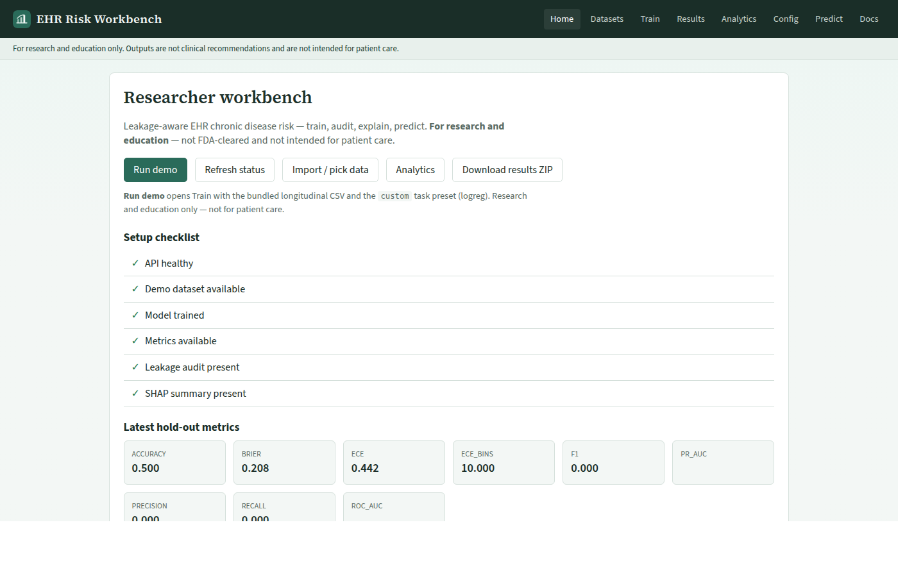
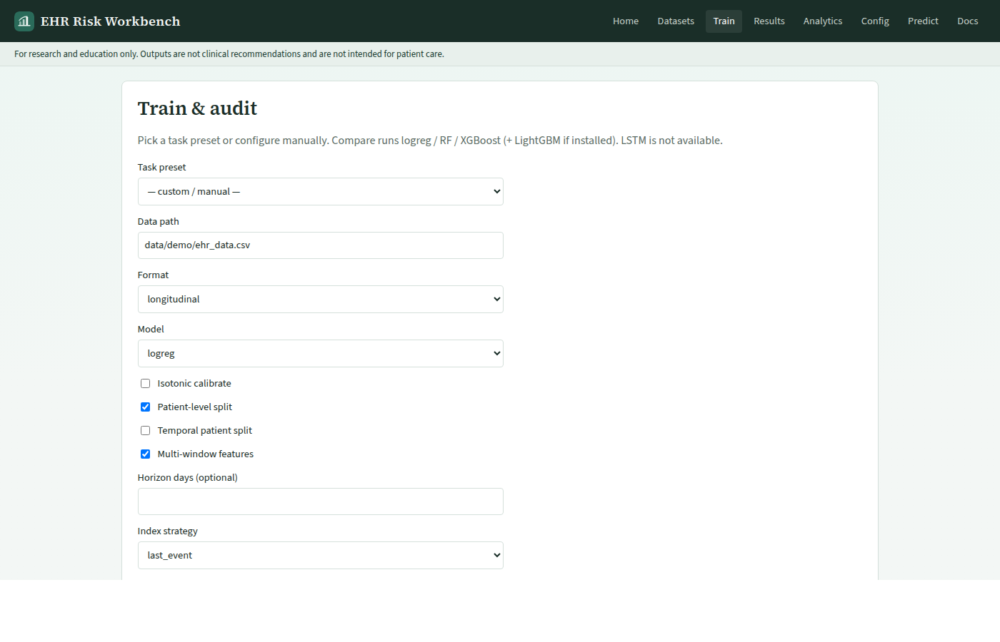
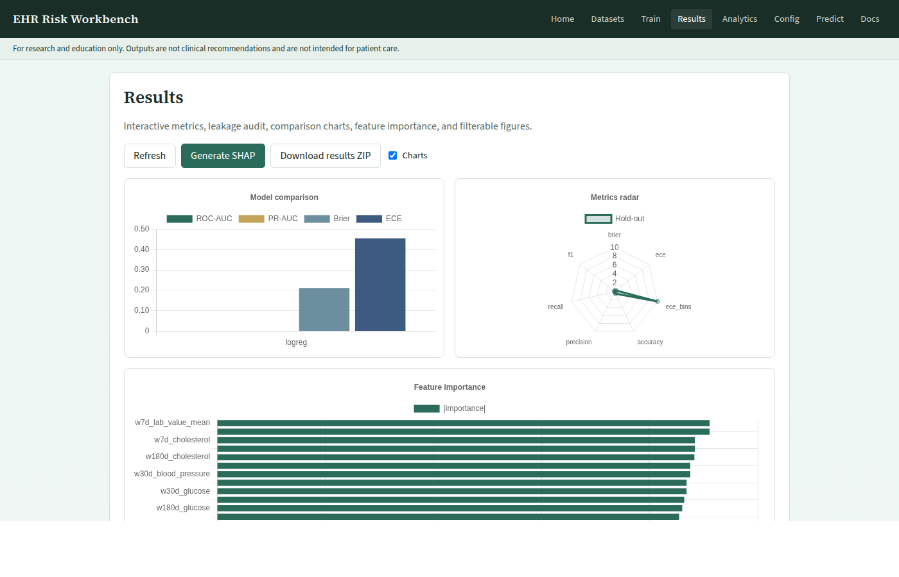
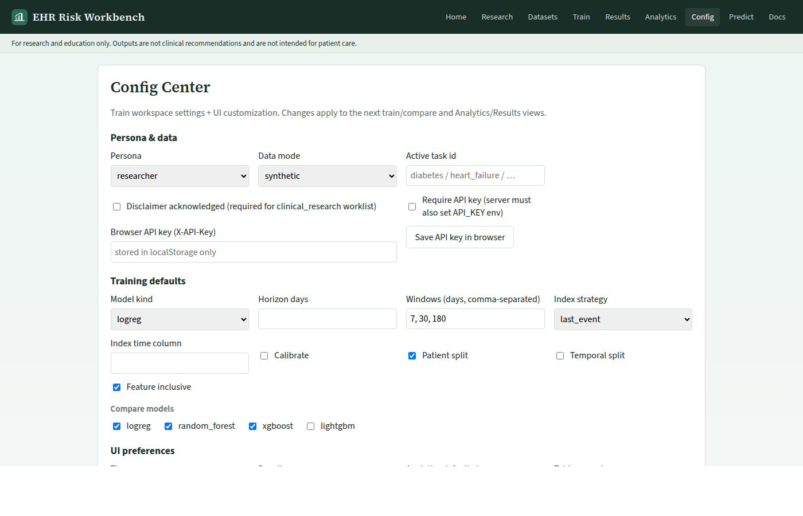

# EHR Risk Framework

[](https://github.com/ranasl62/ehr-chronic-disease-risk-prediction/actions/workflows/ci.yml)
[](LICENSE)
[](CHANGELOG.md)
[](https://doi.org/10.5281/zenodo.21448693)
[](https://ehr.larucare.com/)
[](https://ehr-risk-framework.larucare.com/)

**An open-source framework for leakage-safe, calibrated, and explainable EHR risk prediction.**

Leakage-aware **clinical machine learning** workbench for research and education: temporal splits, leakage audits, Brier/ECE calibration, SHAP, FastAPI + Angular + Docker.  
Default demos cover chronic-disease-style horizons; any binary outcome with an index time and horizon can use the same pipeline (see `tasks/`).  
Package `openhealth` · CLI `ehr-ai`.

> **For research and education only.** Outputs are not clinical recommendations and are not intended for patient care.

**Website:** [https://ehr.larucare.com/](https://ehr.larucare.com/) · **Live demo:** [https://ehr-risk-framework.larucare.com/](https://ehr-risk-framework.larucare.com/) · **Maintainer:** Md Rana Hossain · **Contact:** [support@larucare.com](mailto:support@larucare.com) · [LinkedIn](https://www.linkedin.com/in/mdranahossain/)

## What problem does this solve?

Ad-hoc notebooks often skip index-time integrity, calibration, and reproducible audits—so EHR risk models look strong until honest temporal evaluation. This framework gives labs and courses a **shared, leakage-aware loop**: ingest → train → audit → calibrate → explain → serve (research API).

| Doc | Link |
|-----|------|
| **Documentation website** | [ehr.larucare.com](https://ehr.larucare.com/) (source [`docs/`](docs/)) |
| **Live demo (workbench)** | [ehr-risk-framework.larucare.com](https://ehr-risk-framework.larucare.com/) |
| **Live API** | [ehr-api.larucare.com](https://ehr-api.larucare.com/) |
| Blog / tutorials | [Prevent data leakage](https://ehr.larucare.com/blog/prevent-data-leakage-clinical-ai/) · [Risk model quickstart](https://ehr.larucare.com/blog/ehr-risk-prediction-quickstart/) |
| Compare / alternatives | [vs notebooks](https://ehr.larucare.com/compare/vs-ad-hoc-notebooks/) · [vs opaque AutoML](https://ehr.larucare.com/alternatives/opaque-clinical-automl/) |
| Architecture | [`ARCHITECTURE.md`](ARCHITECTURE.md) |
| Install | [`INSTALLATION.md`](INSTALLATION.md) |
| Data | [`DATA_GUIDE.md`](DATA_GUIDE.md) · teaching fixtures in `data/demo/` |
| Why / limits | [`WHY_THIS_FRAMEWORK.md`](WHY_THIS_FRAMEWORK.md) · [`LIMITATIONS.md`](LIMITATIONS.md) |
| SEO checklist | [`docs/SEO_PLAYBOOK.md`](docs/SEO_PLAYBOOK.md) |
| Cite | [`CITATION.cff`](CITATION.cff) · [`docs/citing_and_doi.md`](docs/citing_and_doi.md) |

### Alternatives (short)

Prefer this workbench when you need shared tasks, leakage audits, and calibration reports. Prefer raw notebooks for one-off EDA. Prefer credentialed hospital systems—not this repo—for patient care. See [compare](https://ehr.larucare.com/compare/vs-ad-hoc-notebooks/) and [limits](https://ehr.larucare.com/limits/).

---

## 5-minute start — Docker (recommended)

### Build from source

```bash
git clone https://github.com/ranasl62/ehr-chronic-disease-risk-prediction.git
cd ehr-chronic-disease-risk-prediction
docker compose up --build
# detached: make researcher-up-d
# stop:     docker compose down   # or: make researcher-down
```

### Pull published images (no local build)

Images are on **Docker Hub** (public):

```bash
docker pull ranasl62/ehr-risk-api:latest
docker pull ranasl62/ehr-risk-web:latest
```

Then clone and run Compose (bind-mounts still need the repo tree):

```bash
git clone https://github.com/ranasl62/ehr-chronic-disease-risk-prediction.git
cd ehr-chronic-disease-risk-prediction
docker compose -f docker-compose.yml -f docker-compose.publish.yml pull
docker compose -f docker-compose.yml -f docker-compose.publish.yml up
# or: make researcher-up-pull
```

| Image | Default ref | Hub |
|-------|-------------|-----|
| API / prepare / train | `ranasl62/ehr-risk-api:latest` | [hub.docker.com/r/ranasl62/ehr-risk-api](https://hub.docker.com/r/ranasl62/ehr-risk-api) |
| Angular workbench | `ranasl62/ehr-risk-web:latest` | [hub.docker.com/r/ranasl62/ehr-risk-web](https://hub.docker.com/r/ranasl62/ehr-risk-web) |

Docs: [`docs/docker-images/`](docs/docker-images/) · [`docs/quickstart/`](docs/quickstart/).

Override with `IMAGE_API` / `IMAGE_WEB` in `.env` (see [`.env.example`](.env.example)). Still clone the repo — Compose bind-mounts `.` so `data/`, `reports/`, and `model.pkl` persist on the host.

Optional: `cp .env.example .env` (set `API_KEY`, ports). GPU / overrides: `cp docker-compose.override.example.yml docker-compose.override.yml`.

| Service | URL | Local build | Published |
|---------|-----|-------------|-----------|
| Angular workbench | http://127.0.0.1:8080 | `ehr-risk-web:local` | `ranasl62/ehr-risk-web` |
| API + OpenAPI | http://127.0.0.1:8000/docs (also http://127.0.0.1:8080/api-docs) | `ehr-risk-api:local` | `ranasl62/ehr-risk-api` |
| Results ZIP | http://127.0.0.1:8000/v1/reports/download.zip | — | — |
| **Docs website** | [ehr.larucare.com](https://ehr.larucare.com/) ([`docs/`](docs/)) | — | — |
| **Live demo** | [ehr-risk-framework.larucare.com](https://ehr-risk-framework.larucare.com/) | — | — |
| **Live API** | [ehr-api.larucare.com](https://ehr-api.larucare.com/) | — | — |

**First loop:** Datasets (bundled teaching demos + health) → Train → Results / Analytics → Predict.
Teaching fixtures are `data/demo/ehr_data.csv` (default longitudinal Train path) and `data/demo/sample_ehr.csv`; legacy `data/raw/` references resolve as compatibility fallbacks.
Demo CSVs only — no PHI. **Research and education only** — not for patient care.

**Stop / clean:** `docker compose down` · `docker compose down --rmi local` (also drop local images).

Task presets: [`tasks/`](tasks/). Install notes: [`INSTALLATION.md`](INSTALLATION.md). Architecture: [`ARCHITECTURE.md`](ARCHITECTURE.md).

---

## How this framework helps

| Pain | Framework response |
|------|-------------------|
| Future data leaking into features | Index/horizon truncation + leakage audit job |
| Uncalibrated probabilities | Isotonic calibration + Brier / ECE |
| Opaque tree models | SHAP in API and UI |
| Notebook-only workflows | Docker + Angular + task YAML + results ZIP |
| Unclear product boundaries | [`LIMITATIONS.md`](LIMITATIONS.md) |

If you use this project, please email feedback or open a GitHub issue — details in [`docs/HOW_IT_HELPS.md`](docs/HOW_IT_HELPS.md).

---

## What you can do

- Train logistic regression, random forest, or XGBoost on longitudinal or tabular demo data
- Import BYO CSV (with column mapping), optional SQL / thin OMOP·FHIR adapters
- Run dataset health, multi-model compare, named experiment runs
- Hide bundled demos, browse dataset rows, or delete selected allowed datasets (idempotent if a selected file is already absent)
- Export metrics, audits, and figures; call `POST /v1/predict` with schema-aligned features
- Review light HPO as a best-trial card and trial table, with unavailable metrics rendered as `n/a`
- Customize UI theme/density and train defaults in Config Center

Software verification metrics (synthetic, not clinical) live under the local-only
`research-paper/` package: `make -C research-paper paper-quick` → `research-paper/reports/`.
Credentialed MIMIC (local only): [`docs/mimic_lock_checklist.md`](docs/mimic_lock_checklist.md).

---

## Stack at a glance

```text
Data ingest → health → task YAML → multi-window features → train/compare
    → leakage / SHAP / fairness → FastAPI + Angular
```

| Area | Paths |
|------|--------|
| Framework | `openhealth/`, `tasks/`, `config/` |
| ML | `training/`, `feature_engineering/`, `models/` |
| API / jobs | `api/` |
| UI | `web/` (Angular workbench) |
| Trust scripts | `scripts/leakage_audit.py`, `explain_shap.py`, … |

---

## Screenshots

| Home | Datasets | Train | Results |
|------|----------|-------|---------|
|  |  |  |  |

| Analytics | Predict | Config | OpenAPI |
|-----------|---------|--------|---------|
|  |  |  |  |

Full UI tour: [`docs/workbench/`](docs/workbench/). Refresh: `bash scripts/capture_docs_website_screenshots.sh`.

---

## Development

```bash
pip install -r requirements.txt && pip install -e .
PYTHONPATH=. pytest tests/ -q
cd web && npm install && npm start   # UI :4200 → API :8000
```

Contributing: [`CONTRIBUTING.md`](CONTRIBUTING.md). Authors: [`AUTHORS.md`](AUTHORS.md).

---

## Cite this repository

If you use this software in research, teaching, or a methods pipeline, please cite it.

**Preferred:** GitHub → **Cite this repository** (reads [`CITATION.cff`](CITATION.cff)).

```bibtex
@software{ehr_risk_framework_hossain_2026,
  author       = {Hossain, Md Rana},
  title        = {{EHR Risk Framework}: Leakage-Aware, Calibrated, Explainable Open Software},
  version      = {1.0.0},
  year         = {2026},
  publisher    = {Zenodo},
  doi          = {10.5281/zenodo.21448693},
  url          = {https://doi.org/10.5281/zenodo.21448693},
  license      = {MIT}
}
```

**DOI:** [https://doi.org/10.5281/zenodo.21448693](https://doi.org/10.5281/zenodo.21448693) · details: [`docs/citing_and_doi.md`](docs/citing_and_doi.md).

---

## License & disclaimer

[MIT](LICENSE). Outputs are research probabilities only. You are responsible for PHI, IRB/DUA, and PhysioNet rules when using real data.
